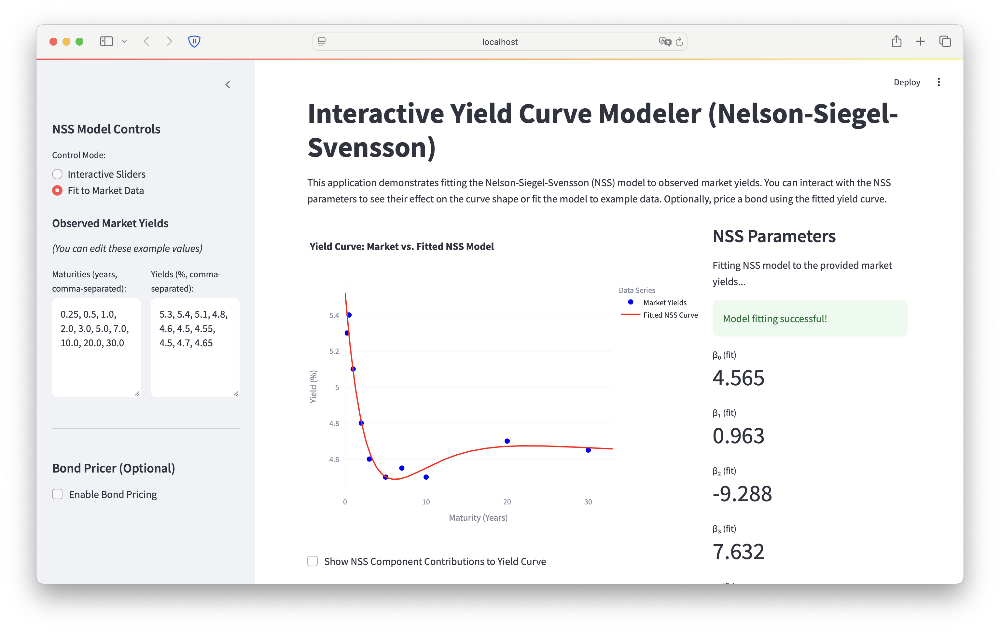

# Interactive Yield Curve Modeler (Nelson-Siegel-Svensson)



This Streamlit application provides an interactive tool for understanding and utilizing the Nelson-Siegel-Svensson (NSS) model for yield curve fitting. Users can visualize how NSS parameters shape the yield curve, fit the model to user-provided or example market yield data, and optionally price a bond using the fitted curve.

This tool is designed to showcase an understanding of fixed income analytics, interest rate modeling, and curve fitting techniques.

## Features

*   **Nelson-Siegel-Svensson (NSS) Model Implementation:**
    *   Accurately calculates yields based on the six NSS parameters.
*   **Interactive Parameter Adjustment:**
    *   Sliders allow users to manually change each of the six NSS parameters ($\beta_0, \beta_1, \beta_2, \beta_3, \tau_1, \tau_2$) and observe the real-time impact on the yield curve's shape.
*   **Model Fitting to Market Data:**
    *   Users can input their own market yields (maturities and corresponding yield percentages) or use pre-filled example data.
    *   The application employs `scipy.optimize.minimize` (L-BFGS-B method) to find the NSS parameters that best fit the observed market data by minimizing the sum of squared errors.
*   **Clear Visualization:**
    *   Plots observed market yields as scatter points and the NSS-generated curve (either from sliders or fitted parameters) as a continuous line using Plotly.
    *   Option to display the individual contributions of each NSS component ($\beta_0$ term, $\beta_1$ term, etc.) to the overall curve shape.
*   **Parameter Display:**
    *   Clearly shows the current values of the NSS parameters, whether set manually or determined by the fitting process.
*   **Bond Pricing (Optional):**
    *   Allows users to input characteristics of a coupon-bearing bond (face value, annual coupon rate, years to maturity, payment frequency).
    *   Prices the bond by discounting its future cash flows using spot rates derived from the currently active (manually set or fitted) NSS yield curve.
*   **Educational Explanations:**
    *   Includes a section explaining the NSS model formula and the interpretation of its parameters.

## Quant Concepts Demonstrated

*   **Term Structure of Interest Rates:** Visualizing and modeling how interest rates vary across different maturities.
*   **Yield Curve Fitting Models:** Practical application and fitting of the Nelson-Siegel-Svensson parametric model.
*   **Interpretation of Model Parameters:** Understanding how $\beta_0$ (level), $\beta_1$ (slope), $\beta_2$ (curvature), $\beta_3$ (second curvature), $\tau_1$, and $\tau_2$ (decay factors) influence the yield curve.
*   **Spot Rates for Valuation:** Implicitly, the NSS curve provides spot rates, which are used in the bond pricing feature to discount cash flows.
*   **Bond Pricing using a Yield Curve:** Demonstrates how a fitted yield curve can be used for the fundamental valuation of fixed-income securities.
*   **Optimization Techniques:** Application of numerical optimization (`scipy.optimize.minimize`) to solve a real-world financial modeling problem.

## Requirements

*   Python 3.8+
*   The libraries listed in `requirements.txt`:
    *   streamlit
    *   numpy
    *   pandas
    *   plotly
    *   scipy

## Installation

1.  **Clone the repository (or download the `app.py` script):**


2.  **Create and activate a virtual environment (recommended):**
```bash
python -m venv venv
# On Windows
# venv\Scripts\activate
# On macOS/Linux
# source venv/bin/activate
```

1.  **Install the required packages:**
```bash
pip install -r requirements.txt
```
    Otherwise, install them manually:
```bash
pip install streamlit numpy pandas plotly scipy
```

## Running the App

Once the dependencies are installed, navigate to the directory containing `app.py` and run:

```bash
streamlit run app.py
```

Your web browser should open automatically to the application's URL (usually `http://localhost:8501`).

## How to Use

1.  **Input Market Data (Sidebar):**
    *   Modify the example "Maturities" (in years) and "Yields" (in percent) in the sidebar text areas. Ensure values are comma-separated and the number of maturities matches the number of yields.
2.  **Choose Control Mode (Sidebar):**
    *   **"Interactive Sliders":** Use the sliders in the right-hand panel to manually adjust each NSS parameter. Observe how the red "Fitted NSS Curve" changes in the main plot.
    *   **"Fit to Market Data":** The application will attempt to find the NSS parameters that best match the market data you provided. The fitted parameters and the resulting curve will be displayed.
3.  **View Plot (Main Panel):**
    *   The main plot shows your market data points and the NSS curve.
    *   Optionally, check "Show NSS Component Contributions" to see how each part of the NSS formula shapes the curve.
4.  **Price a Bond (Optional - Sidebar):**
    *   Enable "Enable Bond Pricing".
    *   Enter the bond's face value, coupon rate, maturity, and payment frequency.
    *   Click "Price Bond using Fitted Curve". The price will be calculated using the spot rates derived from the currently active NSS curve.

## Technical Stack

*   **Streamlit:** For building the interactive web application.
*   **NumPy:** For numerical computations, especially array operations.
*   **Pandas:** For data structures (though minimally used in this specific app, good practice for data handling).
*   **Plotly:** For creating interactive charts and visualizations.
*   **SciPy:** For scientific computing, specifically `scipy.optimize.minimize` for the NSS model fitting.

---